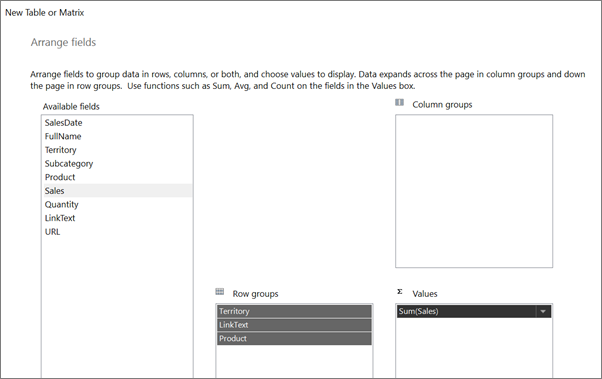
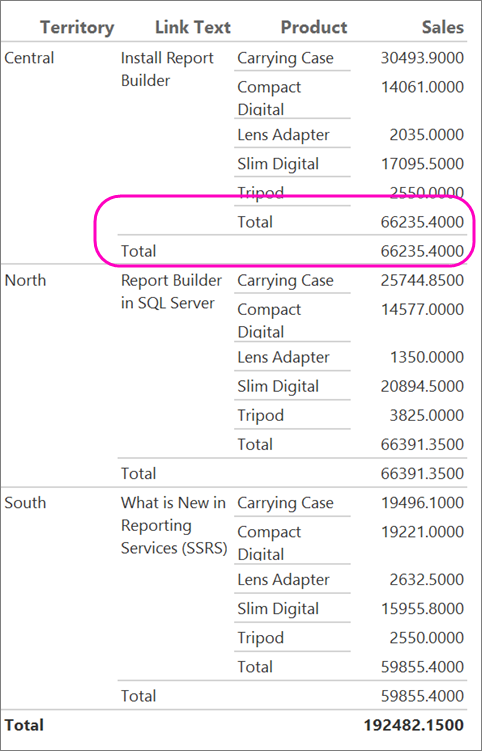
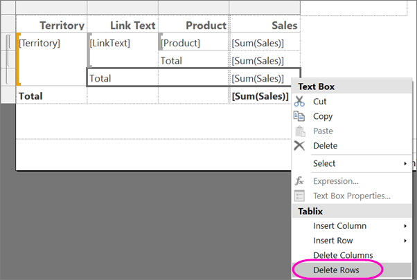
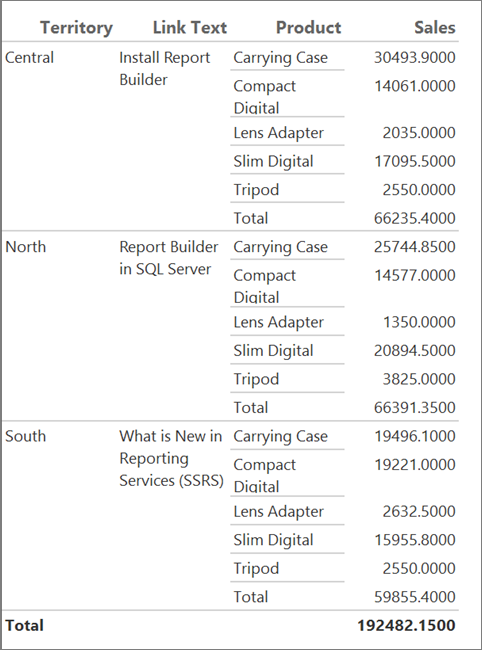
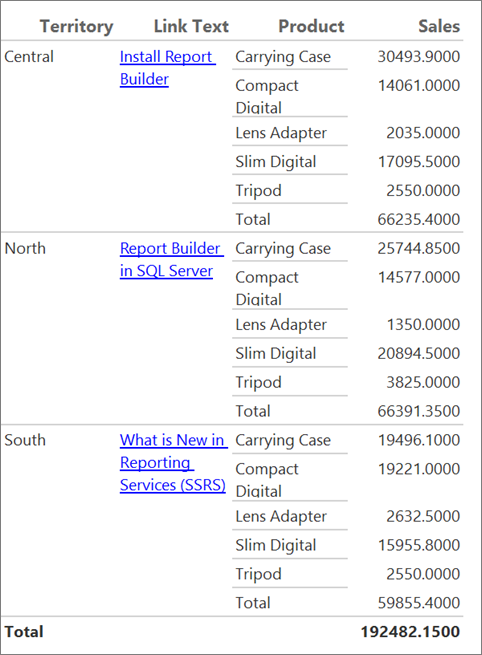
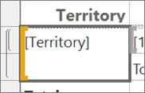
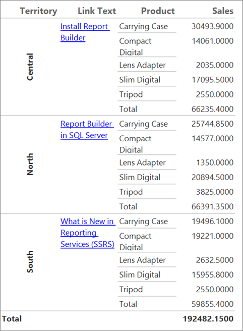
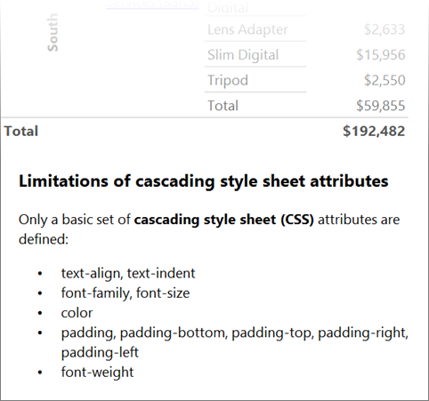

# <a name="tutorial-format-text-report-builder"></a>Esercitazione: Formattazione di testo (Generatore report)

In questa esercitazione verranno illustrati i vari modi in cui è possibile formattare il testo in un report impaginato di [!INCLUDE[ssRSnoversion_md](../includes/ssrsnoversion-md.md)] . È possibile provare formati diversi. 

Dopo avere impostato il report vuoto con l'origine dati e il set di dati, è possibile scegliere i formati che si vuole esplorare. Nell'immagine seguente viene illustrato un report simile a quello che verrà creato.  
  
 
  
In un passaggio si introdurrà intenzionalmente un errore, in modo da comprenderne gli effetti. Si correggerà quindi l'errore per ottenere il risultato desiderato.  
    
Il tempo stimato per il completare l'esercitazione è di 20 minuti.  
  
## <a name="requirements"></a>Requisiti  
Per informazioni sui requisiti, vedere [Prerequisiti per le esercitazioni &#40;Generatore report&#41;](../reporting-services/prerequisites-for-tutorials-report-builder.md).  
  
## <a name="CreateReport"></a>Creare un report vuoto con un'origine dati e un set di dati  
  
### <a name="to-create-a-blank-report"></a>Per creare un report vuoto  
  
1.  [Avviare Generatore report](../reporting-services/report-builder/start-report-builder.md) dal computer, dal portale Web di [!INCLUDE[ssRSnoversion_md](../includes/ssrsnoversion-md.md)] o in modalità integrata SharePoint.  
  
    Si apre la finestra di dialogo **Nuovo report o set di dati**.  
  
    Se la finestra di dialogo **Nuovo report o set di dati** non è visualizzata, scegliere **Nuovo** dal menu **File**.  
 
2.  Nel riquadro sinistro della finestra di dialogo **Riquadro attività iniziale** verificare che l'opzione **Nuovo report** sia selezionata.  
  
3.  Nel riquadro destro fare clic su **Report vuoto**.  
  
### <a name="to-create-a-data-source"></a>Per creare un'origine dati  
  
1.  Nel riquadro Dati report fare clic su **Nuovo** > **Origine dati**.  

    Se il riquadro **Dati report** non è visualizzato, fare clic su **Dati report** nella scheda **Visualizza**.
  
2.  Nella casella **Nome** digitare: **TextDataSource**  
  
3.  Fare clic su **Usa una connessione incorporata nel report**.  
  
4.  Verificare che il tipo di connessione sia Microsoft SQL Server, quindi nella casella **Stringa di connessione** digitare: `Data Source = <servername>`  
  
    > [!NOTE]  
    > L'espressione `<servername>`, ad esempio Report001, indica un computer in cui è installata un'istanza del motore di database di SQL Server. Questa esercitazione non sono necessari dati specifici. è sufficiente una connessione a un database di SQL Server. Se in **Connessioni a origini dati**è già disponibile una connessione, è possibile selezionarla e passare alla procedura successiva, ovvero "Per creare un set di dati". Per altre informazioni, vedere [Modalità alternative di acquisizione di una connessione dati &#40;Generatore report&#41;](../reporting-services/alternative-ways-to-get-a-data-connection-report-builder.md).  
  
5.  [!INCLUDE[clickOK](../includes/clickok-md.md)]  
  
### <a name="to-create-a-dataset"></a>Per creare un set di dati  
  
1.  Nel riquadro Dati report fare clic su **Nuovo** > **Set di dati**.  
  
2.  Verificare che l'origine dati sia **TextDataSource**.  
  
3.  Nella casella **Nome** digitare: **TextDataset**.  
  
4.  Verificare che il tipo di query **Testo** sia selezionato, quindi fare clic su **Progettazione query**.  
  
5.  Fare clic su **Modifica come testo**.  
  
6.  Incollare la query seguente nel relativo riquadro:  

    > [!NOTE]  
    > Per evitare di dover disporre di un'origine dati esterna, nella query di questa esercitazione sono già inclusi i valori dei dati. Tale condizione rende tuttavia la query piuttosto lunga. In una query di un ambiente aziendale non sarebbe incluso alcun dato. Questo esempio è solo a scopo illustrativo.  
  
    ```  
    SELECT CAST('2015-01-05' AS date) as SalesDate, 'Lauren Johnson' as FullName,'Central' as Territory, 'Accessories' as Subcategory,'Carrying Case' as Product, CAST(16996.60 AS money) AS Sales, 68 as Quantity, 'Install Report Builder' as LinkText, 'http://go.microsoft.com/fwlink/?LinkId=154882' AS URL  
    UNION SELECT CAST('2015-01-05' AS date) as SalesDate, 'Warren Pal' as FullName,'North' as Territory, 'Accessories' as Subcategory, 'Carrying Case' as Product, CAST(13747.25 AS money) AS Sales, 55 as Quantity, 'Report Builder in SQL Server' as Link, 'http://go.microsoft.com/fwlink/?LinkId=160556' AS URL  
    UNION SELECT CAST('2015-01-05' AS date) as SalesDate, 'Fernando Ross' as FullName,'South' as Territory, 'Accessories' as Subcategory,'Carrying Case' as Product, CAST(9248.15 AS money) As Sales, 37 as Quantity, 'What is New in Reporting Services (SSRS)' as Link, 'http://go.microsoft.com/fwlink/?LinkId=165064' AS URL  
    UNION SELECT CAST('2015-01-05' AS date) as SalesDate, 'Lauren Johnson' as FullName,'Central' as Territory, 'Accessories' as Subcategory,'Tripod' as Product, CAST(1350.00 AS money) AS Sales, 18 as Quantity, 'Install Report Builder' as LinkText, 'http://go.microsoft.com/fwlink/?LinkId=154882' AS URL  
    UNION SELECT CAST('2015-01-05' AS date) as SalesDate, 'Warren Pal' as FullName,'North' as Territory, 'Accessories' as Subcategory,'Tripod' as Product, CAST(1800.00 AS money) AS Sales, 24 as Quantity, 'Report Builder in SQL Server' as Link, 'http://go.microsoft.com/fwlink/?LinkId=160556' AS URL  
    UNION SELECT CAST('2015-01-05' AS date) as SalesDate, 'Fernando Ross' as FullName,'South' as Territory, 'Accessories' as Subcategory,'Tripod' as Product, CAST(1125.00 AS money) AS Sales, 15 as Quantity, 'What is New in Reporting Services (SSRS)' as Link, 'http://go.microsoft.com/fwlink/?LinkId=165064' AS URL  
    UNION SELECT CAST('2015-01-05' AS date) as SalesDate, 'Lauren Johnson' as FullName,'Central' as Territory, 'Accessories' as Subcategory,'Lens Adapter' as Product, CAST(1147.50 AS money) AS Sales, 17 as Quantity, 'Install Report Builder' as LinkText, 'http://go.microsoft.com/fwlink/?LinkId=154882' AS URL  
    UNION SELECT CAST('2015-01-05' AS date) as SalesDate, 'Warren Pal' as FullName,'North' as Territory, 'Accessories' as Subcategory,  'Lens Adapter' as Product, CAST(742.50 AS money) AS Sales, 11 as Quantity, 'Report Builder in SQL Server' as Link, 'http://go.microsoft.com/fwlink/?LinkId=160556' AS URL  
    UNION SELECT CAST('2015-01-05' AS date) as SalesDate, 'Fernando Ross' as FullName,'South' as Territory, 'Accessories' as Subcategory,'Lens Adapter' as Product, CAST(1417.50 AS money) AS Sales, 21 as Quantity, 'What is New in Reporting Services (SSRS)' as Link, 'http://go.microsoft.com/fwlink/?LinkId=165064' AS URL  
    UNION SELECT CAST('2015-01-06' AS date) as SalesDate, 'Lauren Johnson' as FullName,'Central' as Territory, 'Accessories' as Subcategory, 'Carrying Case' as Product, CAST(13497.30 AS money) AS Sales, 54 as Quantity, 'Install Report Builder' as LinkText, 'http://go.microsoft.com/fwlink/?LinkId=154882' AS URL  
    UNION SELECT CAST('2015-01-06' AS date) as SalesDate, 'Warren Pal' as FullName,'North' as Territory, 'Accessories' as Subcategory, 'Carrying Case' as Product, CAST(11997.60 AS money) AS Sales, 48 as Quantity, 'Report Builder in SQL Server' as Link, 'http://go.microsoft.com/fwlink/?LinkId=160556' AS URL  
    UNION SELECT CAST('2015-01-06' AS date) as SalesDate, 'Fernando Ross' as FullName,'South' as Territory, 'Accessories' as Subcategory, 'Carrying Case' as Product, CAST(10247.95 AS money) As Sales, 41 as Quantity, 'What is New in Reporting Services (SSRS)' as Link, 'http://go.microsoft.com/fwlink/?LinkId=165064' AS URL  
    UNION SELECT CAST('2015-01-06' AS date) as SalesDate, 'Lauren Johnson' as FullName,'Central' as Territory, 'Accessories' as Subcategory, 'Tripod' as Product, CAST(1200.00 AS money) AS Sales, 16 as Quantity, 'Install Report Builder' as LinkText, 'http://go.microsoft.com/fwlink/?LinkId=154882' AS URL  
    UNION SELECT CAST('2015-01-06' AS date) as SalesDate, 'Warren Pal' as FullName,'North' as Territory, 'Accessories' as Subcategory,'Tripod' as Product, CAST(2025.00 AS money) AS Sales, 27 as Quantity, 'Report Builder in SQL Server' as Link, 'http://go.microsoft.com/fwlink/?LinkId=160556' AS URL  
    UNION SELECT CAST('2015-01-06' AS date) as SalesDate, 'Fernando Ross' as FullName,'South' as Territory, 'Accessories' as Subcategory,'Tripod' as Product, CAST(1425.00 AS money) AS Sales, 19 as Quantity, 'What is New in Reporting Services (SSRS)' as Link, 'http://go.microsoft.com/fwlink/?LinkId=165064' AS URL  
    UNION SELECT CAST('2015-01-06' AS date) as SalesDate, 'Lauren Johnson' as FullName,'Central' as Territory, 'Accessories' as Subcategory,'Lens Adapter' as Product, CAST(887.50 AS money) AS Sales, 13 as Quantity, 'Install Report Builder' as LinkText, 'http://go.microsoft.com/fwlink/?LinkId=154882' AS URL  
    UNION SELECT CAST('2015-01-06' AS date) as SalesDate, 'Warren Pal' as FullName,'North' as Territory, 'Accessories' as Subcategory, 'Lens Adapter' as Product, CAST(607.50 AS money) AS Sales, 9 as Quantity, 'Report Builder in SQL Server' as Link, 'http://go.microsoft.com/fwlink/?LinkId=160556' AS URL  
    UNION SELECT CAST('2015-01-06' AS date) as SalesDate, 'Fernando Ross' as FullName,'South' as Territory, 'Accessories' as Subcategory,'Lens Adapter' as Product, CAST(1215.00 AS money) AS Sales, 18 as Quantity, 'What is New in Reporting Services (SSRS)' as Link, 'http://go.microsoft.com/fwlink/?LinkId=165064' AS URL  
    UNION SELECT CAST('2015-01-05' AS date) as SalesDate,  'Lauren Johnson' as FullName,'Central' as Territory, 'Digital' as Subcategory,'Compact Digital' as Product, CAST(10191.00 AS money) AS Sales, 79 as Quantity, 'Install Report Builder' as LinkText, 'http://go.microsoft.com/fwlink/?LinkId=154882' AS URL  
    UNION SELECT CAST('2015-01-05' AS date) as SalesDate,  'Warren Pal' as FullName,'North' as Territory, 'Digital' as Subcategory, 'Compact Digital' as Product, CAST(8772.00 AS money) AS Sales, 68 as Quantity, 'Report Builder in SQL Server' as Link, 'http://go.microsoft.com/fwlink/?LinkId=160556' AS URL  
    UNION SELECT CAST('2015-01-05' AS date) as SalesDate,  'Fernando Ross' as FullName,'South' as Territory, 'Digital' as Subcategory, 'Compact Digital' as Product, CAST(10578.00 AS money) AS Sales, 82 as Quantity, 'What is New in Reporting Services (SSRS)' as Link, 'http://go.microsoft.com/fwlink/?LinkId=165064' AS URL  
    UNION SELECT CAST('2015-01-05' AS date) as SalesDate, 'Lauren Johnson' as FullName,'Central' as Territory,'Digital' as Subcategory, 'Slim Digital' as Product, CAST(7218.10 AS money) AS Sales, 38 as Quantity, 'Install Report Builder' as LinkText, 'http://go.microsoft.com/fwlink/?LinkId=154882' AS URL  
    UNION SELECT CAST('2015-01-05' AS date) as SalesDate, 'Warren Pal' as FullName,'North' as Territory,'Digital' as Subcategory, 'Slim Digital' as Product, CAST(8357.80 AS money) AS Sales, 44 as Quantity, 'Report Builder in SQL Server' as Link, 'http://go.microsoft.com/fwlink/?LinkId=160556' AS URL  
    UNION SELECT CAST('2015-01-05' AS date) as SalesDate, 'Fernando Ross' as FullName,'South' as Territory,'Digital' as Subcategory,'Slim Digital' as Product, CAST(9307.55 AS money) AS Sales, 49 as Quantity, 'What is New in Reporting Services (SSRS)' as Link, 'http://go.microsoft.com/fwlink/?LinkId=165064' AS URL  
    UNION SELECT CAST('2015-01-06' AS date) as SalesDate,  'Lauren Johnson' as FullName,'Central' as Territory, 'Digital' as Subcategory,'Compact Digital' as Product, CAST(3870.00 AS money) AS Sales, 30 as Quantity, 'Install Report Builder' as LinkText, 'http://go.microsoft.com/fwlink/?LinkId=154882' AS URL  
    UNION SELECT CAST('2015-01-06' AS date) as SalesDate,  'Warren Pal' as FullName,'North' as Territory, 'Digital' as Subcategory,'Compact Digital' as Product, CAST(5805.00 AS money) AS Sales, 45 as Quantity, 'Report Builder in SQL Server' as Link, 'http://go.microsoft.com/fwlink/?LinkId=160556' AS URL  
    UNION SELECT CAST('2015-01-06' AS date) as SalesDate,  'Fernando Ross' as FullName,'South' as Territory, 'Digital' as Subcategory, 'Compact Digital' as Product, CAST(8643.00 AS money) AS Sales, 67 as Quantity, 'What is New in Reporting Services (SSRS)' as Link, 'http://go.microsoft.com/fwlink/?LinkId=165064' AS URL  
    UNION SELECT CAST('2015-01-06' AS date) as SalesDate, 'Lauren Johnson' as FullName,'Central' as Territory, 'Digital' as Subcategory, 'Slim Digital' as Product, CAST(9877.40 AS money) AS Sales, 52 as Quantity, 'Install Report Builder' as LinkText, 'http://go.microsoft.com/fwlink/?LinkId=154882' AS URL  
    UNION SELECT CAST('2015-01-06' AS date) as SalesDate, 'Warren Pal' as FullName,'North' as Territory, 'Digital' as Subcategory, 'Slim Digital' as Product, CAST(12536.70 AS money) AS Sales, 66 as Quantity, 'Report Builder in SQL Server' as Link, 'http://go.microsoft.com/fwlink/?LinkId=160556' AS URL  
    UNION SELECT CAST('2015-01-06' AS date) as SalesDate, 'Fernando Ross' as FullName,'South' as Territory, 'Digital' as Subcategory, 'Slim Digital' as Product, CAST(6648.25 AS money) AS Sales, 35 as Quantity, 'What is New in Reporting Services (SSRS)' as Link, 'http://go.microsoft.com/fwlink/?LinkId=165064' AS URL  
    ```  
  
7.  Scegliere Esegui (**!**) per eseguire la query.  
  
    I risultati della query corrispondono ai dati disponibili per la visualizzazione nel report.  
  
8.  [!INCLUDE[clickOK](../includes/clickok-md.md)]

9.  [!INCLUDE[clickOK](../includes/clickok-md.md)]  
  
## <a name="AddField"></a>Aggiungere un campo all'are di progettazione del report  
Se si desidera visualizzare un campo del set di dati in un report, è probabile che si scelga innanzitutto di trascinarlo direttamente nell'area di progettazione. In questo esercizio viene indicato perché questo modo di procedere non è corretto e quale operazione è invece necessario eseguire.  
  
### <a name="to-add-a-field-to-the-report-and-get-the-wrong-result"></a>Per aggiungere un campo al report (e ottenere il risultato sbagliato)  
  
1.  Trascinare il campo **FullName** dal riquadro Dati report nell'area di progettazione.  
  
    Generatore report crea una casella di testo contenente un'espressione rappresentata da `<Expr>`.  
  
2.  Fare clic su **Esegui**.  
  
    Viene visualizzato un solo record, **Fernando Ross**, che rappresenta il primo record in ordine alfabetico nella query. Il campo non viene ripetuto per visualizzare gli altri record di tale campo.  
  
3.  Fare clic su **Progettazione** per tornare alla visualizzazione Struttura.  
  
4.  Selezionare l'espressione `<Expr>` nella casella di testo.  
  
5.  Nel riquadro Proprietà della proprietà **Value** verrà visualizzato quanto segue (se il riquadro Proprietà non è visualizzato, selezionare **Proprietà** nella scheda **Visualizza**):  
  
    ```  
    =First(Fields!FullName.Value, "TextDataSet")  
    ```  
  
    La funzione `First` è progettata per recuperare solo il primo valore in un campo, così come è avvenuto.  
  
    Il trascinamento del campo direttamente nell'area di progettazione ha determinato la creazione di una casella di testo. Le caselle di testo non sono di per sé aree dati e pertanto non consentono di visualizzare i dati di un set di dati del report. Le caselle di testo incluse in aree dati, ad esempio tabelle, matrici ed elenchi, consentono invece di visualizzare dati.  
  
6.  Selezionare la casella di testo (se l'espressione è stata selezionata, premere ESC per selezionare la casella di testo), quindi premere CANC.  
  
### <a name="to-add-a-field-to-the-report-and-get-the-right-result"></a>Per aggiungere un campo al report (e ottenere il risultato corretto)  
  
1.  Fare clic su **Elenco** nell'area **Aree dati** della scheda **Inserisci**sulla barra multifunzione . Fare clic nell'area di progettazione, quindi trascinare il mouse per creare una casella di circa 2 pollici (5 centimetri) di larghezza e 1 pollice (2,5 centimetri) di altezza.  
  
2.  Trascinare il campo **FullName** dal riquadro Dati report nella casella di riepilogo.  
  
    Questa volta Generatore report crea una casella di testo contenente l'espressione `[FullName]` .  
  
3.  Fare clic su **Esegui**.  
  
    Si noti che in questo caso le casella viene ripetuta per visualizzare tutti i record nella query.  
  
4.  Fare clic su **Progettazione** per tornare alla visualizzazione Struttura.  
  
5.  Selezionare l'espressione nella casella di testo.  
  
6.  Nel riquadro Proprietà della proprietà **Value** verrà visualizzato quanto segue:  
  
    ```  
    =Fields!FullName.Value  
    ```  
  
    Trascinando la casella di testo nell'area dati dell'elenco, i dati inclusi nel campo vengono visualizzati nel set di dati.  
  
7.  Selezionare la casella di riepilogo e premere CANC.  
  
## <a name="AddTable"></a>Aggiungere una tabella all'area di progettazione del report  
Creare questa tabella per avere un elemento in cui inserire i collegamenti ipertestuali e il testo ruotato.   
  
1.  Nella scheda **Inserisci** > **Tabella** > **Creazione guidata Tabella**.  
  
2.  Nella pagina **Scegliere un set di dati** della Creazione guidata tabella o matrice fare clic su **Scegli un set di dati esistente in questo report o un set di dati condiviso** > **TextDataset (in questo report)** > **Avanti**.  
  
3.  Nella pagina **Disponi campi** trascinare i campi **Territory**, **LinkText**e **Product** in **Gruppi di righe**, trascinare il campo **Sales** in **Valori**, quindi fare clic su **Avanti**.  

    
  
4.  Nella pagina **Scegliere il layout** deselezionare la casella di controllo **Espandi/comprimi gruppi** per visualizzare l'intera tabella, quindi fare clic su **Avanti**. 
  
5.  Fare clic su **Fine**.  
  
6.  Fare clic su **Esegui**.  
  
    La tabella ha un aspetto corretto, ma dispone di due righe dei totali. Per il campo **LinkText** non è necessaria una riga per il totale.  
    
    
  
8.  Fare clic su **Progettazione** per tornare alla visualizzazione Struttura.  
  
9. Selezionare la cella **Totale** nella colonna **LinkText** , quindi tenere premuto MAIUSC e selezionare le due celle a destra che corrispondono alla cella vuota della colonna **Product** e alla cella `[Sum(Sales)]` della colonna **Sales** .  
  
11. Con queste tre celle selezionate fare clic con il pulsante destro del mouse su una delle celle e scegliere **Elimina righe**.  

    
  
12. Fare clic su **Esegui**.  

    Adesso il report ha una sola riga per il totale.
    
    
  
## <a name="AddHyperlink"></a>Aggiungere un collegamento ipertestuale al report  
In questa sezione si aggiungerà un collegamento ipertestuale al testo incluso nella tabella creata nella sezione precedente.  
  
1.  Fare clic su **Progettazione** per tornare alla visualizzazione Struttura.  
  
2.  Fare clic con il pulsante destro del mouse sulla cella contenente `[LinkText]`, quindi scegliere **Proprietà casella di testo**.  
  
3.  Nella scheda **Azione** fare clic su **Vai a URL**.  
  
5.  Nella casella **Seleziona un URL** fare clic su **[URL]**, quindi scegliere **OK**.  
  
6.  Si noti che il testo non presenta alcuna differenza. È necessario renderlo simile al testo di un collegamento.  
  
7.  Selezionare `[LinkText]`.  
  
8.  Nella scheda **Home** > **Carattere** selezionare **Sottolineato** e cambiare **Colore** in **Blu**.  
  
9. Fare clic su **Esegui**.  
  
    L'aspetto del testo è ora simile a quello di un collegamento.  
    
    
  
10. Fare clic su un collegamento. Se il computer è connesso a Internet, in una finestra del browser verrà aperto un argomento della Guida di Generatore report.  
  
## <a name="RotateText"></a>Ruotare il testo nel report  
In questa sezione si ruoterà parte del testo incluso nella tabella creata nelle sezioni precedenti.  
 
1.  Fare clic su **Progettazione** per tornare alla visualizzazione Struttura.  
  
2.  Fare clic nella cella che contiene `[Territory].`  
  
3.  Nella scheda **Home** della sezione **Carattere** fare clic sul pulsante **Grassetto** .  
  
4.  Se il riquadro Proprietà non è visualizzato, selezionare la casella di controllo **Proprietà** nella scheda **Vista** .  
  
5.  Individuare la proprietà WritingMode nel riquadro Proprietà e modificarlo da **Predefinito** a **Rotate270**.  
 
    > [!NOTE]  
    > Se le proprietà nel riquadro Proprietà sono organizzate in categorie, WritingMode si trova nella categoria **Localizzazione** . Assicurarsi di aver selezionato la cella e non il testo. WritingMode è una proprietà della casella di testo, non del testo.  

    
   
6.  Nella scheda **Home** della sezione **Paragrafo** selezionare **Al centro** e **Al centro** per posizionare il testo al centro delle celle sia verticalmente sia orizzontalmente.  
  
8.  Fare clic su Esegui (**!**).  
  
Il testo incluso nella cella `[Territory]` scorre ora verticalmente dal basso verso l'alto delle celle.  



## <a name="FormatCurrency"></a>Applicare il formato valuta  
  
1.  Fare clic su **Progettazione** per passare alla visualizzazione Struttura.  
  
2.  Fare clic sulla cella prima cella tabella contenente `[Sum(Sales)]`, tenere premuto MAIUSC e fare clic sull'ultima cella della tabella contenente `[Sum(Sales)]`.  
  
3.  Nella scheda **Home** > gruppo **Numero** > pulsante **Valuta**.  
  
4.  (Facoltativo)     Se l'impostazione locale è Inglese (Stati Uniti), il testo dell'esempio predefinito è [**$12,345.00**]. Se non viene visualizzato un valore di valuta di esempio, fare clic su **Stili segnaposto** Valori di esempio **nel gruppo** > **Numeri**.  

    
  
5.  (Facoltativo) Nel gruppo **Numero** della scheda **Home** fare clic due volte sul pulsante **Diminuisci decimali** per visualizzare le cifre in dollari senza centesimi.  
  
6.  Fare clic su Esegui (**!**) per visualizzare l'anteprima del report.  
  
Nel report verranno visualizzati i dati formattati che rendono più facile la lettura.  


    
## <a name="FormatHTML"></a>Visualizzazione del testo con formattazione HTML  
  
1.  Fare clic su **Progettazione** per passare alla visualizzazione Struttura.  
  
2.  Nella scheda **Inserisci** fare clic su **Casella di testo**, quindi nell'area di progettazione fare clic e trascinare il mouse per creare, sotto la tabella, una casella di testo di circa 10 centimetri di larghezza e 8 centimetri di altezza.  
  
3.  Copiare questo testo e incollarlo nella casella di testo:  
  
    ```  
    <h4>Limitations of cascading style sheet attributes</h4>  
          <p>Only a basic set of <b>cascading style sheet (CSS)</b> attributes are defined:</p>  
          <ul><li>  
              text-align, text-indent  
            </li><li>  
              font-family, font-size  
            </li><li>  
              color  
            </li><li>  
              padding, padding-bottom, padding-top, padding-right, padding-left  
            </li><li>  
              font-weight  
            </li></ul>  
    ```  
  
4.  Trascinare il bordo inferiore della casella di testo in modo che contenga tutto il testo. L'area di progettazione viene ingrandita mentre che si trascina il mouse.

5. Selezionare tutto il testo presente nella casella di testo.  
  
5.  Fare clic con il pulsante destro del mouse su tutto il testo selezionato, quindi scegliere **Proprietà testo**.  
  
    Poiché questa è una proprietà del testo e non della casella di testo, in una casella di testo è possibile avere una combinazione di testo normale e di testo in cui vengono utilizzati tag HTML come stili.  
  
6.  Nella scheda **Generale** in **Tipo di markup**fare clic su **HTML - Interpreta i tag HTML come stili**.  
  
7.  Scegliere **OK**.  
  
8.  Fare clic su Esegui (**!**) per visualizzare l'anteprima del report.  
  
Il testo nella casella di testo viene visualizzato come un'intestazione, un paragrafo e un elenco puntato.  
  


## <a name="Save"></a>Salvare il report  
È possibile salvare i report in un server di report, in una raccolta di SharePoint o nel computer locale.  
  
In questa esercitazione il report verrà salvato in un server di report. Se non si dispone dell'accesso a un server di report, sarà possibile salvare il report nel computer locale.  
  
### <a name="to-save-the-report-on-a-report-server"></a>Per salvare il report in un server di report  
  
1.  Fare clic sul pulsante **Generatore report** , quindi su **Salva con nome**.  
  
2.  Fare clic su **Siti e server recenti**.  
  
3.  Selezionare o digitare il nome del server di report per il quale si dispone delle autorizzazioni di salvataggio dei report.  
  
    Verrà visualizzato il messaggio "Connessione al server di report". Al termine della connessione, verrà visualizzato il contenuto della cartella di report specificata dall'amministratore del server di report come posizione predefinita per i report.  
  
4.  In **Nome**sostituire il nome predefinito con un nome a scelta.

5.  Fare clic su **Salva**.  
  
Il report verrà salvato sul server di report. Il nome del server di report al quale si è connessi verrà visualizzato sulla barra di stato nella parte inferiore della finestra.  
  
### <a name="to-save-the-report-on-your-computer"></a>Per salvare il report nel computer  
  
1.  Fare clic sul pulsante **Generatore report** , quindi su **Salva con nome**.  
  
2.  Fare clic su **Desktop**, **Documenti**o **Risorse del computer**, quindi selezionare la cartella in cui si desidera salvare il report.  
  
3.  In **Nome**sostituire il nome predefinito con un nome a scelta. 
  
4.  Fare clic su **Salva**.  

## <a name="next-steps"></a>Passaggi successivi

Ci sono vari modi per formattare il testo in Generatore report. [Esercitazione: Creazione di un Report in formato libero](../reporting-services/tutorial-creating-a-free-form-report-report-builder.md) inclusi altri esempi.  

[Esercitazioni di Generatore report ](../reporting-services/report-builder-tutorials.md)  
 [formattazione degli elementi del Report](../reporting-services/report-design/formatting-report-items-report-builder-and-ssrs.md)  
[Generatore report in SQL Server 2016](../reporting-services/report-builder/report-builder-in-sql-server-2016.md)  

Ulteriori domande? [Provare a porre il forum di Reporting Services](http://go.microsoft.com/fwlink/?LinkId=620231)
