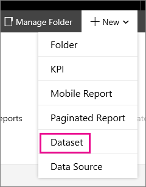
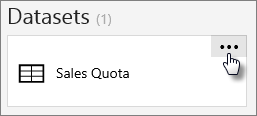
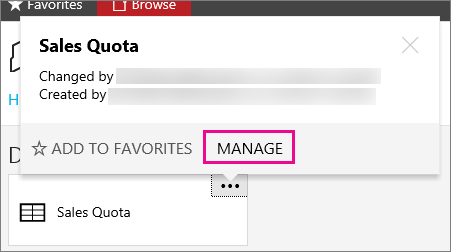
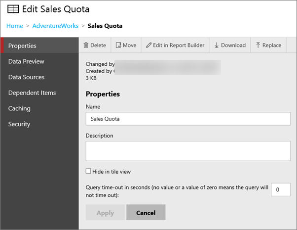
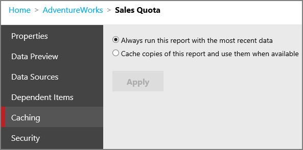
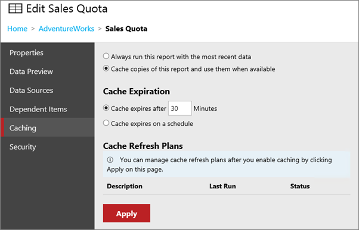
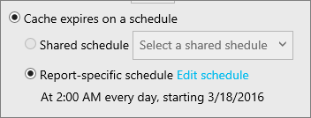
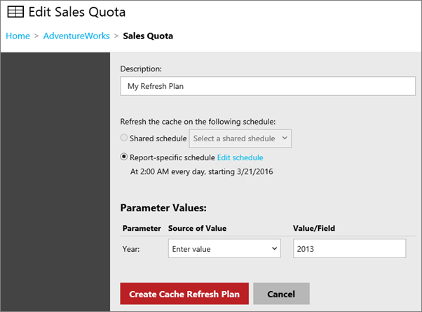

# Utilizzare i set di dati condivisi - portale web

[!INCLUDE[ssrs-appliesto](../includes/ssrs-appliesto.md)] [!INCLUDE[ssrs-appliesto-2016-and-later](../includes/ssrs-appliesto-2016-and-later.md)] [!INCLUDE[ssrs-appliesto-pbirsi](../includes/ssrs-appliesto-pbirs.md)]

Un set di dati condiviso consente di gestire le impostazioni per un set di dati separatamente dai report e dagli altri elementi del catalogo che lo usano. I set di dati condivisi possono essere usati con i report impaginati e per dispositivi mobili, oltre che con gli indicatori KPI.

È possibile visualizzare e gestire le proprietà di un set di dati condivisi all'interno del portale Web. Dal portale Web è possibile avviare Generatore report per creare o modificare i set di dati condivisi.

## Creare un set di dati condiviso
  
Per creare un nuovo set di dati condiviso, eseguire le operazioni seguenti.  
  
1.  Scegliere Nuovo dalla barra dei menu.  
  
2.  Selezionare **Set di dati**.  
  
      
  
3.  Verrà così avviato Generatore Report oppure viene chiesto di scaricarlo.  
  
4.  Nella finestra di dialogo **Nuovo report o set di dati** selezionare una connessione all'origine dati da usare per il set di dati. Potrebbe essere necessario passare alla posizione dell'origine dati condivisa.  
  
5.  Selezionare **Crea**.  
  
6.  Creare il set di dati e quindi selezionare l'icona **Salva** in alto a sinistra per salvare di nuovo il set di dati nel server d report.  
  
## Gestire un set di dati condiviso esistente
  
Per gestire un set di dati condiviso esistente, è possibile eseguire le operazioni seguenti.  
  
> [!NOTE]
> Se il set di dati condiviso non è visualizzato nella cartella, assicurarsi che sia attiva la visualizzazione dei set di dati. È possibile scegliere **Visualizza** nella barra dei menu in alto a destra nel portale Web. Assicurarsi che sia selezionato **Set di dati** .  
  
1.  Selezionare il **i puntini di sospensione (...)**  per il set di dati che si desidera gestire.  
  
      
  
2.  Selezionare **Gestisci** per visualizzare la schermata di modifica.  
  
      
  
## Proprietà
  
Nella schermata delle proprietà è possibile modificare **Nome** e **Descrizione** per il set di dati. È anche possibile scegliere **Elimina**, **Sposta**, **Modifica in Generatore report**, **Scarica** o **Sostituisci**.  
  
  
  
## Memorizzazione nella cache
  
Per la memorizzazione nella cache dei dati per un set di dati sono disponibili varie opzioni. Per iniziare, è necessario effettuare una semplice selezione.  
  
1.  **Esegui sempre il report con i dati più recenti** consente di eseguire query sull'origine dati quando richiesto.  
  
2.  **Memorizzare nella cache copie di questo report e usarle quando disponibili** consente di posizionare una copia temporanea dei dati in una cache per l'uso con gli elementi che usano questo set di dati. La memorizzazione nella cache consente in genere di migliorare le prestazioni in quanto i dati vengono restituiti dalla cache anziché tramite una nuova query del set di dati.  
  
  
  
Con la selezione di **Memorizzare nella cache copie di questo report e usarle quando disponibili** verranno visualizzate altre opzioni.  
  
  
  
### Scadenza della cache  
  
È possibile stabilire se si vuole che la cache scada, per il set di dati condiviso, dopo un determinato periodo di tempo oppure se si preferisce impostare una pianificazione. È possibile usare una pianificazione condivisa  
  
  
  
> [!NOTE]
> L'impostazione di scadenza non comporta l'aggiornamento della cache. Senza un piano di aggiornamento della cache, i dati verranno aggiornati durante l'esecuzione successiva del set di dati.  
  
### Piani di aggiornamento della cache  
  
È possibile usare piani di aggiornamento della cache per creare pianificazioni per precaricare nella cache copie temporanee di dati per un set di dati condiviso. Un piano di aggiornamento include una pianificazione e l'opzione per specificare o eseguire l'override di valori per i parametri. Non è possibile eseguire l'override di valori per i parametri contrassegnati come di sola lettura. È possibile creare e usare più piani di aggiornamento.   
  
Le assegnazioni di ruolo predefinite che consentono di aggiungere, eliminare e modificare set di dati condivisi per i piani di aggiornamento della cache sono Gestione contenuto, Report personali e Server di pubblicazione.  
  
Dopo aver applicato l'opzione per la cache sopra indicata, è possibile definire un piano di aggiornamento della cache. A tale scopo, selezionare il collegamento **Gestisci piani di aggiornamento della cache** visualizzato dopo aver applicato le impostazioni della cache. Verrà visualizzata la pagina del piano di aggiornamento della cache.   
  
Per creare un nuovo piano di aggiornamento della cache, selezionare **Nuovo piano di aggiornamento della cache**. È quindi possibile immettere un nome per il piano e specificare una pianificazione. Se per il set di dati sono stati definiti parametri, verranno elencati e sarà possibile specificare valori, a meno che non siano contrassegnati come di sola lettura.  
  
Al termine, selezionare **Crea piano di aggiornamento della cache**.  
  
  
  
> [!NOTE]
> Per creare un piano di aggiornamento della cache, è necessario che il servizio SQL Server Agent sia in esecuzione.  
  
Sarà quindi possibile **modificare** o **eliminare** i piani elencati. L'opzione **Nuovo piano da esistente** viene abilitata quando è selezionato un solo piano di aggiornamento della cache. Consente di creare un nuovo piano di aggiornamento copiato dal piano originale. La pagina del piano di aggiornamento della cache viene aperta con i dettagli dal piano selezionato. È possibile modificare le opzioni del piano di aggiornamento e salvare il piano con una nuova descrizione.  

Ulteriori domande? [Provare a porre il forum di Reporting Services](http://go.microsoft.com/fwlink/?LinkId=620231)

