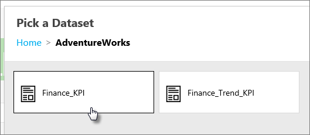
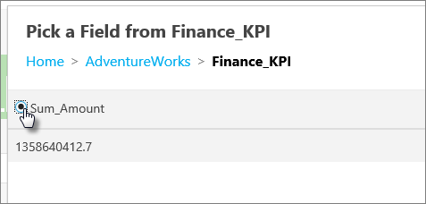
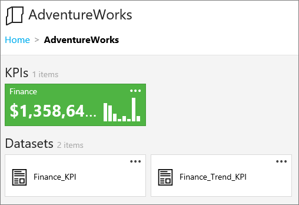

# Usare gli indicatori KPI in Reporting Services
Un indicatore di prestazioni chiave (KPI, Key Performance Indicator) è un'indicazione visiva che comunica il progresso compiuto verso un obiettivo.  Gli indicatori KPI consentono a team, manager e aziende di valutare con rapidità l'avanzamento compiuto verso risultati misurabili.   
  
Grazie agli indicatori KPI, SQL Server 2016 Reporting Services consente di rispondere con facilità alle domande seguenti:  
  
-   A che punto sono rispetto al raggiungimento dell'obiettivo?  
  
-   Quanto sono avanti o indietro rispetto al raggiungimento dell'obiettivo?  
  
-   Quale obiettivo minimo ho raggiunto?  
  
## Creazione di un set di dati  
Un indicatore KPI usa solo la prima riga di dati di un set di dati condiviso. Verificare che i dati da usare si trovino nella prima riga. Per creare un set di dati condiviso, è possibile usare Generatore report o SQL Server Data Tools.  
  
> **Nota**: non è necessario che il set di dati si trovi nella stessa cartella dell'indicatore KPI.  
  
## Posizionamento di indicatori KPI  
  
È possibile creare gli indicatori KPI in qualsiasi cartella nel server di report.  Prima di creare un indicatore KPI, è bene considerare quale sia il percorso corretto in cui inserirlo. È consigliabile, ad esempio, collocarlo in una cartella visibile agli utenti e al contempo pertinente anche per altri report e indicatori KPI.  
  
## Aggiunta di un indicatore KPI  
  
Dopo aver stabilito la posizione dell'indicatore KPI, passare alla cartella e nel menu principale selezionare **Nuovo** > **KPI**.  
  
  
  
Verrà visualizzata la schermata **Nuovo indicatore KPI**.  
  
  
  
È possibile assegnare valori statici o usare i dati di un set di dati condiviso. L'indicatore KPI appena creato verrà popolato con un set casuale di dati da aggiornare manualmente.  
  
|Campo|Description|  
|---|---|  
|Formato del valore|  Consente di modificare il formato del valore visualizzato.|   
|Valore|Il valore da visualizzare per l'indicatore KPI.|  
|Obiettivo|Usato come confronto con un valore numerico e visualizzato come differenza della percentuale.|  
|Stato|Valore numerico usato per determinare il colore del riquadro dell'indicatore KPI. Sono valori validi 1 (verde), 0 (ambra) e -1 (rosso).|  
|Set di tendenze|Valori numerici delimitati da virgole usati per le visualizzazioni dei grafici. Può essere impostato su una colonna di un set di dati con valori che rappresentano la tendenza.|  
  
> **Avviso**: sebbene in fase di progettazione sia possibile usare il valore in lettere per il campo **Stato**, per l'aggiornamento del set di dati è necessario usare il valore numerico. Aggiornando il set di dati con il valore letterale invece che numerico, l'indicatore KPI nel server potrebbe essere danneggiato.  
  
> **Nota**: per i campi **Valore**, **Obiettivo** e **Stato** è possono scegliere solo un valore nella prima riga del risultato di un set di dati. Per il campo **Set di tendenze** è invece possibile scegliere la colonna che riflette la tendenza.  
  
Per usare i dati di un nuovo set di dati condiviso, eseguire le operazioni seguenti.  
  
1.  Modificare la casella di riepilogo a discesa da **Imposta manualmente** o **Non impostato** a **Campo del set di dati**.  
  
      
  
2.  Selezionare i **puntini** nella casella dei dati. Verrà visualizzata la schermata **Scegliere un set di dati**.  
  
      
  
3.  Selezionare il set di dati contenente i dati da visualizzare.  
  
4.  Scegliere il campo da usare. Fare clic su **OK**.  
  
      
  
5.  Modificare il campo **Formato valore** affinché corrisponda al valore desiderato. In questo esempio, il valore è una valuta.  
  
      
  
6.  Selezionare **Applica**.  
  
      
  
## Rimozione di un indicatore KPI  
  
Per rimuovere un indicatore KPI eseguire una delle operazioni seguenti.  
  
1.  Selezionare i **puntini** dell'indicatore KPI da rimuovere. Selezionare **Gestisci**.  
  
      
  
2.  Selezionare **Elimina**. Selezionare di nuovo **Elimina** nella finestra di dialogo di conferma.  
  
      
  
## Aggiornamento di un indicatore KPI  
  
Per aggiornare l'indicatore KPI, è necessario configurare il **Piano di aggiornamento della cache** del set di dati condiviso. Attualmente, non è possibile configurare un piano di aggiornamento della cache dal portale web. È quindi necessario passare al precedente Gestione report a tale scopo.   
  
Di seguito viene illustrato come configurare un piano di aggiornamento della cache con alcune impostazioni di base. Per altre informazioni sui piani di aggiornamento della cache, vedere [Opzioni di aggiornamento Cache (Gestione report)](Cache%20Refresh%20Options%20(Report%20Manager).xml).  
  
1.  Aprire Gestione report e quindi individuare il set di dati condiviso per il quale configurare le proprietà del piano di aggiornamento della cache.   
  
2.  Passare con il puntatore del mouse sul report quindi selezionare la freccia a discesa.  
  
3.  Nell'elenco a discesa selezionare **Gestisci**. Verrà visualizzata la pagina delle proprietà **Generale**.  
  
4.  Selezionare la scheda **Opzioni di aggiornamento cache**.  
  
5.  Per creare un nuovo piano della cache, selezionare **Nuovo piano di aggiornamento della cache**.  
  
      
  
6.  Verrà visualizzato un messaggio che chiede se si desidera abilitare la memorizzazione nella cache per questo elemento con le opzioni predefinite. Fare clic su **OK**.  
  
    > **Nota**: per creare un piano di aggiornamento della cache, è necessario abilitare e avviare il servizio SQL Server Agent.  
  
7.  È possibile scegliere una pianificazione specifica oppure selezionare una pianificazione condivisa, se presente.  
  
8.  Quando si esegue la pianificazione per il piano di aggiornamento della cache, i valori dell'indicatore KPI verranno aggiornati.  
  
      
  
## Vedere anche  
  
- [Portale Web (modalità nativa SSRS)](../reporting-services/web-portal-ssrs-native-mode.md)  
  
- [Opzioni di aggiornamento cache (Gestione report)](Cache%20Refresh%20Options%20(Report%20Manager).xml)  
  
    
  
  
  
