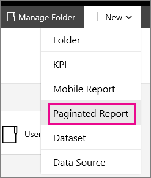
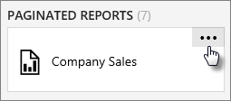
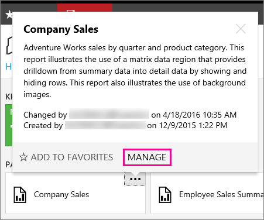
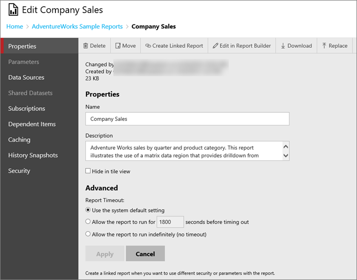
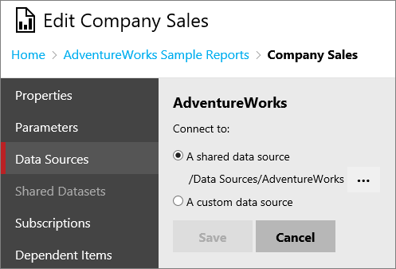
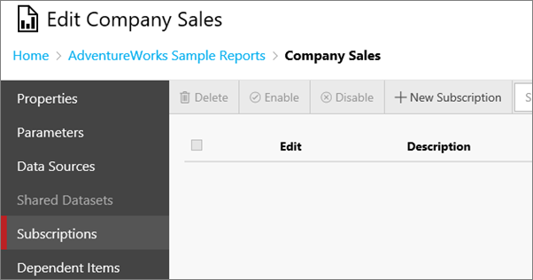
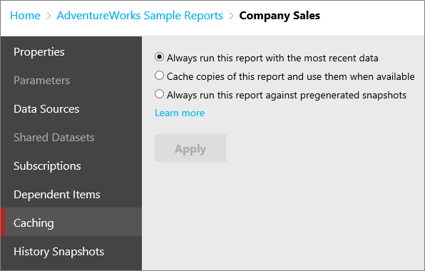
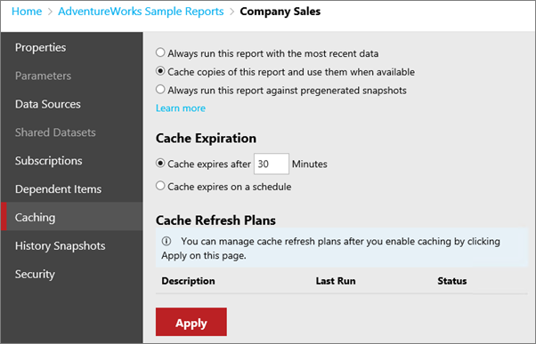
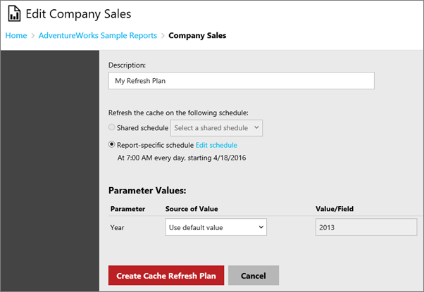

# Utilizzo di report impaginati (portale web)

[!INCLUDE[ssrs-appliesto](../includes/ssrs-appliesto.md)] [!INCLUDE[ssrs-appliesto-2016-and-later](../includes/ssrs-appliesto-2016-and-later.md)] [!INCLUDE[ssrs-appliesto-pbirsi](../includes/ssrs-appliesto-pbirs.md)]

È possibile visualizzare e gestire le proprietà di un report impaginato all'interno del portale Web, da cui è possibile anche avviare Generatore report per creare o modificare report impaginati.  
   
## Creare un report impaginato
  
  
Per creare un nuovo set di dati condiviso, eseguire le operazioni seguenti.  
  
1.  Scegliere Nuovo dalla barra dei menu.  
  
2.  Selezionare **Report impaginato**.  
  
      
  
3.  Verrà così avviato Generatore Report oppure viene chiesto di scaricarlo.  
  
4.  Creare il report e quindi selezionare l'icona **Salva** in alto a sinistra per salvare di nuovo il report impaginato nel server di report.  
  
## Gestire un report impaginato esistente
  
  
Per gestire un report impaginato esistente, è possibile eseguire le operazioni seguenti.  
  
> [!NOTE]
> Se il report impaginato non è contenuto nella cartella, assicurarsi che sia attiva la visualizzazione dei report impaginati. È possibile scegliere **Visualizza** nella barra dei menu in alto a destra nel portale Web. Assicurarsi che sia selezionata l'opzione **Report impaginati** .  
  
1.  Selezionare il **i puntini di sospensione (...)**  per il set di dati che si desidera gestire.  
      
      
  
2.  Selezionare **Gestisci** per visualizzare la schermata di modifica.  
    
      
  
## Proprietà
  
  
Nella schermata delle proprietà è possibile modificare **Nome** e **Descrizione** per il report impaginato. È anche possibile scegliere **Elimina**, **Sposta**, **Crea report collegato**, **Modifica in Generatore report**, **Scarica** o **Sostituisci**.  
    
  
   
## Parametri
  
  
È possibile modificare i parametri esistenti di un report impaginato. Per aggiungere un nuovo parametro, è necessario modificare il report in Generatore Report o SQL Server Data Tools.  
  
  
   
## Data Source
  
È possibile selezionare un'origine dati condivisa oppure immettere le informazioni di connessione per un'origine dati personalizzata.  
  
  
  
Per specificare un'origine dati personalizzata, vengono usate le opzioni seguenti.  
  
**Tipo**  
  
Consente di specificare l'estensione per l'elaborazione dati usata per elaborare i dati dall'origine dati. Per un elenco delle estensioni per i dati predefinite, vedere [Origini dati supportate da Reporting Services (SSRS)]. È possibile che siano disponibili ulteriori estensioni per l'elaborazione dati di terze parti.  
  
**Stringa di connessione**  
  
Specificare la stringa di connessione utilizzata dal server di report per la connessione all'origine dati. Il tipo di connessione determina la sintassi da utilizzare. Ad esempio, una stringa di connessione per l'estensione per l'elaborazione dei dati XML è rappresentata da un URL per un documento XML. In una stringa di connessione tipica vengono in genere specificati il server di database e un file di dati. L'esempio seguente illustra una stringa di connessione usata per la connessione a un database di SQL Server denominato MyData:  
  
    data source=(a SQL Server instance);initial catalog=MyData  
  
È possibile configurare una stringa di connessione come espressione in modo da poter specificare l'origine dati in fase di esecuzione. Le espressioni dell'origine dati sono definite nel report in Progettazione report e non possono essere definite, visualizzate o modificate nel portale Web. È tuttavia possibile sostituire un'espressione di origine dati scegliendo **Ignora predefinita** per digitare una stringa di connessione statica. Per tornare nuovamente all'espressione, fare clic su **Ripristina predefinita**. Nel server di report viene archiviata la stringa di connessione originale che può essere utilizzata nel caso sia necessario ripristinarla. Per utilizzare le espressioni dell'origine dati, è necessario utilizzare le informazioni di connessione all'origine dati pubblicate originariamente con il report. Le origini dati condivise non supportano l'utilizzo di espressioni nella stringa di connessione.  
  
**Credenziali**  
  
È possibile specificare l'opzione che determina come vengono ottenute le credenziali.  
  
> [!IMPORTANT]
> Se le credenziali vengono specificate nella stringa di connessione, le opzioni e i valori selezionati in questa sezione vengono ignorati. Si noti che le credenziali specificate nella stringa di connessione sono visibili in forma non crittografata per tutti gli utenti che accedono a questa pagina.  
  
**Come l'utente che visualizza il report**  
  
Consente di utilizzare le credenziali di Windows dell'utente corrente per accedere all'origine dati. Selezionare questa opzione se le credenziali utilizzate per l'accesso a un'origine dati corrispondono a quelle utilizzate per l'accesso al dominio di rete. È consigliabile utilizzare questa opzione quando per il dominio è abilitata l'autenticazione Kerberos oppure quando l'origine dei dati si trova nello stesso computer del server di report. Se Kerberos non è abilitato, le credenziali di Windows non possono essere passate a un altro servizio o a un computer remoto. Se sono necessarie ulteriori connessioni al computer, i dati previsti non verranno visualizzati e verrà invece visualizzato un errore.  
  
Un amministratore del server di report può disabilitare l'utilizzo della sicurezza integrata di Windows per l'accesso alle origini dati del report. Se questo valore è disattivato, la funzionalità non è disponibile.  
  
Non utilizzare questa opzione se si prevede di pianificare o sottoscrivere questo report. L'elaborazione pianificata o automatica dei report richiede credenziali che è possibile ottenere senza l'input dell'utente o il contesto di sicurezza di un utente corrente. Questa funzionalità è offerta solo dalle credenziali archiviate. Per questo motivo, il server di report impedisce la pianificazione dell'elaborazione di report o di sottoscrizioni se il report è configurato per il tipo di credenziali della sicurezza integrata di Windows. Se si sceglie questa opzione per un report già sottoscritto o per il quale sono previste operazioni pianificate, le sottoscrizioni e le operazioni pianificate vengono arrestate.  
  
**Usando queste credenziali**  
  
Consente di archiviare nome utente e password in forma crittografata nel database del server di report. Selezionare questa opzione per eseguire un report in modo automatico, ad esempio nel caso di report avviati tramite pianificazioni o eventi anziché da un'azione dell'utente.   
  
È anche possibile scegliere il tipo di credenziali: l'autenticazione di Windows (nome utente e password di Windows) o le credenziali di un database specifico (nome utente e password del database), ad esempio l'autenticazione di SQL.  
  
Se si scelgono le credenziali di Windows, l'account specificato deve disporre di autorizzazioni di accesso locale nel computer che ospita l'origine dati usata dal report.  
  
Selezionare **Accedere con queste credenziali ma provare a rappresentare l'utente che visualizza il report** per consentire la delega delle credenziali, ma solo se un'origine dati supporta la rappresentazione. Nei database di SQL Server questa opzione imposta la funzione SETUSER. In Analysis Services usa la proprietà EffectiveUserName.  
  
**Richiedendo le credenziali all'utente che visualizza il report**  
  
Tutti gli utenti devono digitare un nome utente e una password per accedere all'origine dati. È possibile specificare il testo per il messaggio di richiesta delle credenziali utente. Ad esempio: "Immettere il nome utente e la password per accedere all'origine dati".  
  
È anche possibile scegliere il tipo di credenziali: l'autenticazione di Windows (nome utente e password di Windows) o le credenziali di un database specifico (nome utente e password del database), ad esempio l'autenticazione di SQL.  
  
**Senza credenziali**  
  
In questo caso, non è necessario specificare alcun tipo di credenziali per l'origine dati. Se un'origine dati richiede l'accesso da parte degli utenti, la selezione di questa opzione non avrà alcun effetto. È consigliabile selezionare questa opzione solo se la connessione all'origine dei dati non richiede credenziali utente.  
  
Per usare questa opzione, è necessario aver prima configurato l'account di esecuzione automatica per il server di report. L'account di esecuzione automatica consente di connettersi a origini dati esterne quando non sono disponibili altri tipi di credenziali. Se si specifica questa opzione e l'account non è configurato, la connessione all'origine dati del report ha esito negativo e il report non viene elaborato. Per altre informazioni su questo account, vedere [Configurare l'account di esecuzione automatica (Gestione configurazione SSRS)](../reporting-services/install-windows/configure-the-unattended-execution-account-ssrs-configuration-manager.md).  
  
## Sottoscrizioni
  
Una sottoscrizione di Reporting Services è una configurazione che recapita un report in un momento specifico o in risposta a un evento e in un formato di file precedentemente specificato. Ad esempio, è possibile salvare il report MonthlySales.rdl ogni mercoledì come documento di Microsoft Word in una condivisione file. Le sottoscrizioni possono essere usate per pianificare e automatizzare il recapito di un report e con un set specifico di valori di parametri di report. Per ulteriori informazioni, vedere [utilizzo delle sottoscrizioni di](working-with-subscriptions-web-portal.md).
  

   
## Elementi dipendenti
  
La pagina Elementi dipendenti consente di visualizzare l'elenco degli elementi a cui si fa riferimento in questo report. Per ognuno di essi un'icona indica di che tipo di elemento si tratta. È quindi possibile selezionare il **i puntini di sospensione (...)**  su ogni elemento per gestire gli elementi ulteriormente.  
  
## Memorizzazione nella cache
  
Per la memorizzazione nella cache di un report impaginato sono disponibili varie opzioni. Per iniziare, è necessario effettuare una semplice selezione.  
  
1.  **Esegui sempre il report con i dati più recenti** consente di eseguire query sull'origine dati ogni volta che si esegue il report. In questo modo viene generato un report su richiesta con i dati più aggiornati. Ogni volta che si apre il report, infatti, viene creata una nuova istanza del report con i risultati di una nuova query. In questo modo se un report viene aperto da dieci utenti contemporaneamente, per l'elaborazione delle istanze del report vengono eseguite dieci query sull'origine dati.  
  
2.  **Memorizzare nella cache copie di questo report e usarle quando disponibili** consente di posizionare una copia temporanea dei dati in una cache per un uso futuro. La memorizzazione nella cache consente in genere di migliorare le prestazioni in quanto i dati vengono restituiti dalla cache anziché tramite una nuova query del set di dati. In questo modo, se dieci utenti aprono il report, solo la prima richiesta risulta una query all'origine dati. Il report viene quindi memorizzato nella cache e gli altri nove utenti visualizzeranno la copia memorizzata nella cache.  
  
3.  **Eseguire sempre questo report in base a snapshot pregenerati** consente di memorizzare nella cache il layout e i dati del report per un determinato periodo di tempo. È possibile eseguire un report come snapshot per evitare che venga eseguito in momenti indesiderati, ad esempio durante un backup pianificato. Lo snapshot può essere quindi aggiornato a intervalli pianificati. [Altre informazioni]  
  
  
   
Con la selezione di **Memorizzare nella cache copie di questo report e usarle quando disponibili** verranno visualizzate altre opzioni.  
  
  

Per ulteriori informazioni, vedere [utilizzo snapshot](working-with-snapshots-web-portal.md).
  
### Scadenza della cache
  
  
È possibile stabilire se si vuole che la cache scada, per il report impaginato, dopo un determinato periodo di tempo oppure se si preferisce impostare una pianificazione. È possibile usare una pianificazione condivisa.  
  
> [!NOTE]
> In questo caso, la cache non viene aggiornata.  
  
### Piani di aggiornamento della cache
  
  
La pagina Piani di aggiornamento della cache consente di creare pianificazioni per precaricare nella cache copie temporanee dei dati relativi a un report impaginato. Un piano di aggiornamento include una pianificazione e l'opzione per specificare o eseguire l'override di valori per i parametri. Non è possibile eseguire l'override di valori per i parametri contrassegnati come di sola lettura. È possibile creare e usare più piani di aggiornamento.  
   
Le assegnazioni di ruolo predefinite che consentono di aggiungere, eliminare e modificare report impaginati per i piani di aggiornamento della cache sono Gestione contenuto, Report personali e Server di pubblicazione.  
  
Dopo aver applicato l'opzione per la cache sopra indicata, è possibile definire un piano di aggiornamento della cache. A tale scopo, selezionare il collegamento **Gestisci piani di aggiornamento della cache** visualizzato dopo aver applicato le impostazioni della cache. Verrà visualizzata la pagina del piano di aggiornamento della cache.   
  
Per creare un nuovo piano di aggiornamento della cache, selezionare **Nuovo piano di aggiornamento della cache**. È quindi possibile immettere un nome per il piano e specificare una pianificazione. Se per il set di dati sono stati definiti parametri, verranno elencati e sarà possibile specificare valori, a meno che non siano contrassegnati come di sola lettura.  
  
Al termine, selezionare **Crea piano di aggiornamento della cache**.  
  
  
  
> [!NOTE]
> Per creare un piano di aggiornamento della cache, è necessario che il servizio SQL Server Agent sia in esecuzione.  
  
Sarà quindi possibile **modificare** o **eliminare** i piani elencati. L'opzione **Nuovo piano da esistente** viene abilitata quando è selezionato un solo piano di aggiornamento della cache. Consente di creare un nuovo piano di aggiornamento copiato dal piano originale. La pagina del piano di aggiornamento della cache viene aperta con i dettagli dal piano selezionato. È possibile modificare le opzioni del piano di aggiornamento e salvare il piano con una nuova descrizione.  
  
## Snapshot della cronologia
  
  
La pagina Snapshot della cronologia consente di visualizzare gli snapshot del report generati e archiviati nel corso del tempo. A seconda delle opzioni impostate, è possibile che la cronologia del report includa solo gli snapshot più recenti.  
  
La cronologia del report viene sempre visualizzata nel contesto del report a cui si riferisce, ovvero non è possibile visualizzare la cronologia di tutti i report in un server di report in un'unica posizione.  
  
Per generare uno snapshot, è necessario che il report possa essere eseguito in modo automatico, ovvero il report deve usare credenziali archiviate e i report con parametri devono includere valori predefiniti per tutti i parametri. Gli snapshot possono essere generati manualmente o come operazione pianificata.   
  
È possibile fare clic su uno snapshot della cronologia del report per visualizzarlo. L'unico elemento distintivo degli snapshot visualizzati nella cronologia del report è rappresentato dalla data e ora di creazione. Non sono disponibili indicatori visivi per distinguere gli snapshot generati tramite una pianificazione o un'operazione manuale.  
  
## Sicurezza
  
La pagina Proprietà di sicurezza consente di visualizzare o modificare le impostazioni di sicurezza che regolano l'accesso al report. Questa pagina è disponibile per gli elementi per i quali l'utente è autorizzato a definire le impostazioni di sicurezza.  
  
Il livello di accesso agli elementi viene impostato tramite assegnazioni di ruolo che specificano le attività consentite per un gruppo o un utente. Le assegnazioni di ruolo sono costituite da un nome di utente o gruppo e da una o più definizioni di ruolo che specificano la raccolta di attività consentite.  
  
**Modifica sicurezza elemento**  
  
Selezionare questa opzione per modificare le impostazioni di sicurezza definite per l'elemento corrente.

## Passaggi successivi

[Portale Web](../reporting-services/web-portal-ssrs-native-mode.md)  
[Utilizzare i set di dati condivisi](../reporting-services/work-with-shared-datasets-web-portal.md)

Ulteriori domande? [Provare a porre il forum di Reporting Services](http://go.microsoft.com/fwlink/?LinkId=620231)
