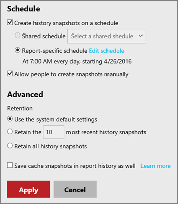

# Uso degli snapshot (portale Web)

[!INCLUDE[ssrs-appliesto-sql2016-preview](../includes/ssrs-appliesto-sql2016-preview.md)]

È possibile controllare se gli snapshot vengono creati per un report, selezionando il **i puntini di sospensione (...)**  di un report, selezionando **Gestisci** e selezionando **la memorizzazione nella cache** o **gli snapshot della cronologia**.  
  
> [!NOTE]
> È necessario avviare il servizio SQL Server Agent.  
   
È possibile creare uno snapshot della cache per consentire un caricamento più rapido delle proprietà di esecuzione specifiche. È anche possibile usare gli snapshot della cronologia per acquisire temporizzazioni.  
  
## Creazione di uno snapshot della cache  
  
È possibile creare uno snapshot effettuando le operazioni seguenti.  
  
  
  
1.  Nella pagina **Memorizzazione nella cache** selezionare **Eseguire sempre questo report in base a snapshot pregenerati** per abilitare le opzioni per la creazione di uno snapshot.  
  
2.  Se si vuole pianificare uno snapshot ricorrente, selezionare **Creare gli snapshot della cache in base a una pianificazione** . È possibile usare una pianificazione condivisa oppure definire una pianificazione personalizzata per aggiornare lo snapshot.  
  
3.  Se si vuole creare immediatamente uno snapshot della cache, selezionare **Creare uno snapshot della cache quando si seleziona Applica in questa pagina** . Se si seleziona solo questa opzione, lo snapshot non verrà aggiornato.  
  
## Creare, modificare ed eliminare snapshot della cronologia  
  
Per usare gli snapshot della cronologia, gestire un report e selezionare **Snapshot della cronologia**.  
  
La pagina **Snapshot della cronologia** consente di visualizzare gli snapshot del report generati e archiviati nel corso del tempo. A seconda delle opzioni impostate nel server di report, è possibile che la cronologia includa solo gli snapshot più recenti.  
  
La cronologia del report viene sempre visualizzata nel contesto del report a cui si riferisce, ovvero non è possibile visualizzare la cronologia di tutti i report in un server di report in un'unica posizione.  
  
Per generare uno snapshot della cronologia, è necessario che il report possa essere eseguito in modo automatico, ovvero il report deve usare credenziali archiviate e i report con parametri devono includere valori predefiniti per tutti i parametri. È possibile generare la cronologia del report manualmente o come operazione pianificata. Le proprietà della cronologia del report determinano i metodi di creazione consentiti.  
  
  
   
1.  Per creare uno snapshot della cronologia, selezionare **+ Nuovo snapshot della cronologia**. Verrà elaborato il report e verrà aggiunta una voce all'elenco.  
  
2.  Per definire le pianificazioni e i criteri di conservazione, passare alle impostazioni .  
  
3.  Selezionare uno snapshot della cronologia per visualizzarlo. L'unico elemento distintivo degli snapshot visualizzati nella cronologia del report è rappresentato dalla data e ora di creazione. Non sono disponibili indicatori visivi per distinguere gli snapshot generati tramite una pianificazione o un'operazione manuale.  
  
### Pianificazione e impostazioni  
  
Se si seleziona **Pianificazione e le impostazioni** , saranno disponibili opzioni aggiuntive per pianificare e controllare la conservazione degli snapshot creati.  
  
  
   
È possibile creare una pianificazione per la creazione degli snapshot. È anche possibile impedire ad altri utenti di creare nuovi snapshot. Se si deseleziona **Consentire agli utenti di creare gli snapshot manualmente** , il **pulsante + Nuovo snapshot della cronologia**verrà disabilitato.  
  
È anche possibile definire la modalità di conservazione degli snapshot.  
  
**Salvare anche gli snapshot della cache nella cronologia del report**  
  
Se si seleziona questa casella di controllo, gli snapshot del report generati in base alle proprietà di esecuzione del report verranno copiati nella cronologia. È possibile impostare le proprietà di esecuzione del report in modo da eseguire un report da uno snapshot generato. L'impostazione di questa proprietà della cronologia consente di mantenere una registrazione di tutti gli snapshot del report generati nel tempo tramite l'inserimento di copie degli snapshot nella cronologia del report.

## Passaggi successivi

[Portale Web](../reporting-services/web-portal-ssrs-native-mode.md)  
[Utilizzo dei report impaginati](working-with-paginated-reports-web-portal.md)  
[Utilizzare i set di dati condivisi](../reporting-services/work-with-shared-datasets-web-portal.md)

Ulteriori domande? [Provare a porre il forum di Reporting Services](http://go.microsoft.com/fwlink/?LinkId=620231)
