# Avviare la procedura guidata Abilitare il database per l'estensione
[!INCLUDE[tsql-appliesto-ss2016-xxxx-xxxx-xxx_md](../../includes/tsql-appliesto-ss2016-xxxx-xxxx-xxx-md.md)]

 Per configurare un database per la funzionalità Estensione database, eseguire la procedura guidata Abilitare il database per l'estensione.  Questo argomento illustra le informazioni da inserire e le opzioni disponibili nella procedura guidata.  
  
 Per altre informazioni su Estensione database, vedere [Estensione database](../../sql-server/stretch-database/stretch-database.md). 
 
 > [!NOTE] 
 > Se successivamente si disabilita Estensione database, tenere presente che questa operazione per una tabella o per un database non elimina l'oggetto remoto. Se si vuole eliminare la tabella remota o il database remoto, è necessario eliminarlo tramite il portale di gestione di Azure. Gli oggetti remoti continuano a generare costi di Azure fino a quando non vengono eliminati manualmente. 
  
## Avviare la procedura guidata  
  
1.  In Esplora oggetti di SQL Server Management Studio selezionare il database per il quale abilitare l'estensione.  
  
2.  Fare clic con il pulsante destro del mouse e selezionare **Attività**, **Estendi**e quindi **Abilita** per avviare la procedura guidata.  
  
##   Introduzione  
 Esaminare lo scopo della procedura guidata e i prerequisiti.  
 
 I prerequisiti importanti includono i seguenti.
 -   È necessario essere un amministratore per modificare le impostazioni del database.
 -   È necessaria una sottoscrizione di Microsoft Azure.
 -   SQL Server deve poter comunicare con il server remoto di Azure.
  
 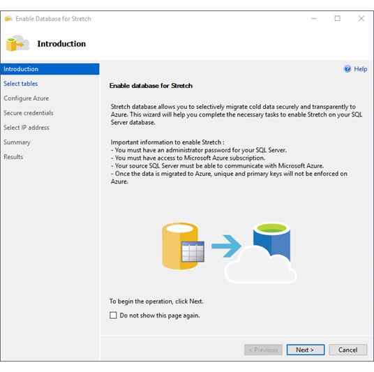  
  
##   Selezionare le tabelle  
 Selezionare le tabelle per le quali si desidera abilitare l'estensione.  
 
Le tabelle con un numero elevato di righe vengono visualizzate nella parte superiore dell'elenco ordinato. Prima di visualizzare l'elenco delle tabelle, la procedura guidata le analizza per controllare la presenza di tipi di dati attualmente non supportati da Estensione database. 
  
 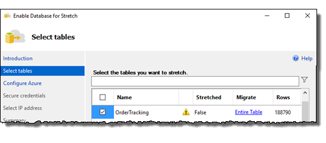  
  
|Colonna|Descrizione|  
|------------|-----------------|  
|(nessun titolo)|Selezionare la casella di controllo in questa colonna per abilitare la tabella selezionata per l'estensione.|  
|**Nome**|Specifica il nome della tabella nel database.|  
|(nessun titolo)|Un simbolo in questa colonna può rappresentare un avviso che non impedisce l'abilitazione della tabella selezionata per l'estensione. Può rappresentare anche un problema che impedisce l'abilitazione della tabella selezionata per l'estensione, ad esempio perché la tabella usa un tipo di dati non supportato. Passare il mouse sul simbolo per visualizzare una descrizione comando con altre informazioni. Per altre informazioni, vedere [Limitazioni per Estensione database](../../sql-server/stretch-database/limitations-for-stretch-database.md).|  
|**Estesa**|Indica se la tabella è già abilitata per l'estensione.|  
|**Migrazione**|È possibile eseguire la migrazione di un'intera tabella (**Intera tabella**) oppure specificare un filtro in una colonna esistente nella tabella. Per usare una funzione di filtro diversa per selezionare le righe di cui eseguire la migrazione, eseguire l'istruzione ALTER TABLE per specificare la funzione di filtro dopo aver chiuso la procedura guidata. Per altre informazioni sulla funzione di filtro, vedere [Select rows to migrate by using a filter function (Selezionare le righe di cui eseguire la migrazione usando una funzione di filtro)](../../sql-server/stretch-database/select-rows-to-migrate-by-using-a-filter-function-stretch-database.md). Per altre informazioni su come applicare la funzione, vedere [Enable Stretch Database for a table (Abilitare Estensione database per una tabella)](../../sql-server/stretch-database/enable-stretch-database-for-a-table.md) o [ALTER TABLE &#40;Transact-SQL&#41;](../../t-sql/statements/alter-table-transact-sql.md).|  
|**Righe**|Specifica il numero di righe della tabella.|  
|**Dimensioni (KB)**|Specifica le dimensioni della tabella in KB.|  
  
## Facoltativamente, specificare un filtro di riga  
 Se si vuole specificare una funzione di filtro per selezionare le righe di cui eseguire la migrazione, seguire questa procedura nella pagina **Seleziona tabelle** .  
  
1.  Nell'elenco **Selezionare le tabelle da estendere** fare clic su **Intera tabella** nella riga della tabella. Viene visualizzata la finestra di dialogo **Selezionare le righe da estendere** .  
  
     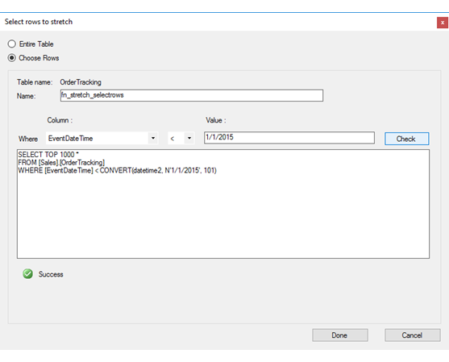  
  
2.  Nella finestra di dialogo **Selezionare le righe da estendere** fare clic su **Scegli righe**.  
  
3.  Nel campo **Nome**specificare un nome per la funzione di filtro.  
  
4.  Per la clausola **Where** , scegliere una colonna dalla tabella, selezionare un operatore e specificare un valore.  
  
5.  Fare clic su **Controlla** per testare la funzione. Se la funzione restituisce i risultati della tabella, ossia se sono presenti righe di cui eseguire la migrazione che soddisfano la condizione, il test visualizza **Esito positivo**.  

> [!NOTE] 
> La casella di testo che visualizza la query del filtro è di sola lettura. Non è possibile modificare la query nella casella di testo.
  
6.  Fare clic su Fine per tornare alla pagina **Seleziona tabelle** .  

La funzione di filtro viene creata in SQL Server solo al termine della procedura guidata. Fino ad allora, è possibile tornare alla pagina **Seleziona tabelle** per modificare o rinominare la funzione di filtro.

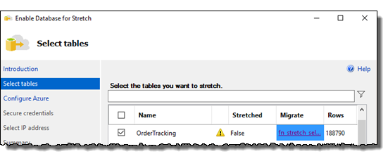

Se si vuole usare un tipo diverso di funzione di filtro per selezionare le righe di cui eseguire la migrazione, effettuare una delle seguenti operazioni.  
  
-   Uscire dalla procedura guidata ed eseguire l'istruzione ALTER TABLE per abilitare l'estensione per la tabella e specificare una funzione di filtro. Per altre informazioni, vedere [Enable Stretch Database for a table (Abilitare Estensione database per una tabella)](../../sql-server/stretch-database/enable-stretch-database-for-a-table.md).  
  
-   Eseguire l'istruzione ALTER TABLE per specificare una funzione di filtro dopo l'uscita dalla procedura guidata. Per i passaggi necessari, vedere [Aggiungere una funzione di filtro dopo l'esecuzione della procedura guidata](../../sql-server/stretch-database/select-rows-to-migrate-by-using-a-filter-function-stretch-database.md#addafterwiz).  
  
##   Configura Azure  
  
1.  Accedere a Microsoft Azure con un account Microsoft.  
  
     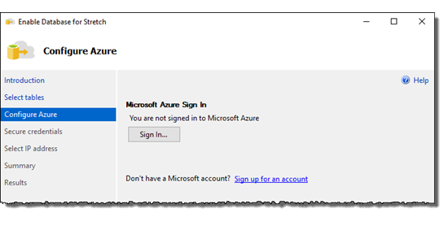  
  
2.  Selezionare la sottoscrizione di Azure da usare per Estensione database. 

> [!NOTE] 
> Per abilitare l'Estensione in un database, è necessario disporre di diritti di amministratore per la sottoscrizione in uso. La procedura guidata di Estensione database visualizzerà solo le sottoscrizioni in cui l'utente ha i diritti di amministratore.
  
3.  Selezionare l'area di Azure da usare per l'estensione del database.
    -   Se si crea un nuovo server, il server viene creato in quest'area.  
    -   Se sono presenti server nell'area selezionata, la procedura guidata li elenca quando si sceglie **Server esistente**.
  
     Per ridurre al minimo la latenza, selezionare l'area di Azure in cui si trova SQL Server. Per altre informazioni sulle aree, vedere [Aree di Azure](https://azure.microsoft.com/regions/).  
  
4.  Specificare se si desidera usare un server esistente o creare un nuovo server Azure.  
  
     Se Active Directory in SQL Server è federata con Azure Active Directory, è possibile usare facoltativamente un account del servizio federato per SQL Server per comunicare con il server Azure remoto. Per altre informazioni sui requisiti per questa opzione, vedere [Opzioni di ALTER DATABASE SET &#40;Transact-SQL&#41;](../../t-sql/statements/alter-database-transact-sql-set-options.md).  
  
    -   **Creazione di un nuovo server**  
  
        1.  Creare un account di accesso e una password dell'amministratore del server.  
  
        2.  È anche possibile usare un account del servizio federato per SQL Server per comunicare con il server Azure remoto.  
  
         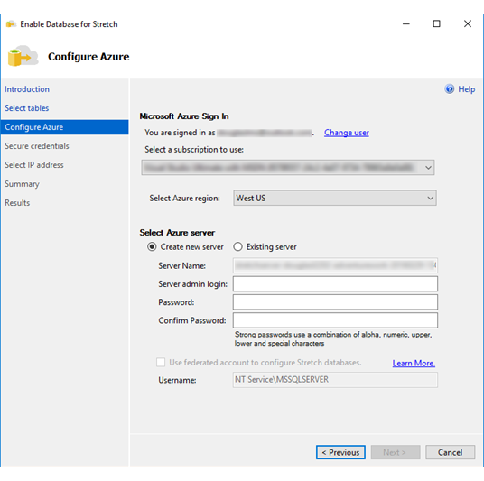  
  
    -   **Server esistente**  
  
        1.  Selezionare il server di Azure esistente.  
  
        2.  Selezionare il metodo di autenticazione.  
  
            -   Se si seleziona **Autenticazione di SQL Server**, specificare un account di accesso di amministratore e la relativa password.  
  
            -   Selezionare **Autenticazione integrata di Active Directory** per usare un account del servizio federato per SQL Server per comunicare con il server Azure remoto. Se il server selezionato non è integrato con Azure Active Directory, questa opzione non viene visualizzata.
  
         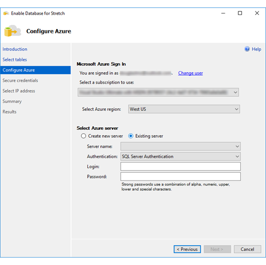  
  
##   Credenziali protette  
 La chiave master del database consente di proteggere le credenziali usate dall'estensione del database per la connessione al database remoto.  
  
 Se esiste già una chiave master del database, immettere la relativa password.  
  
 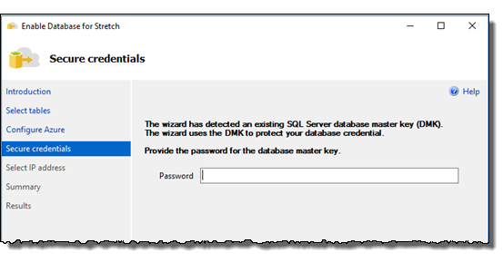  
  
 Se il database non contiene già una chiave master, immettere una password complessa per creare una chiave master del database.  
  
 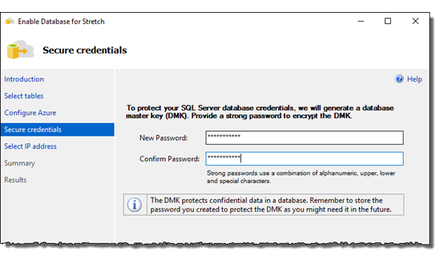  
  
 Per altre informazioni sulla chiave master del database, vedere [CREATE MASTER KEY &#40;Transact-SQL&#41;](../../t-sql/statements/create-master-key-transact-sql.md) e [Creare una chiave master del database](../../relational-databases/security/encryption/create-a-database-master-key.md). Per altre informazioni sulle credenziali create dalla procedura guidata, vedere [CREATE DATABASE SCOPED CREDENTIAL &#40;Transact-SQL&#41;](../../t-sql/statements/create-database-scoped-credential-transact-sql.md).  
  
##   Selezionare l'indirizzo IP  
 Usare l'intervallo di indirizzi IP pubblici della subnet (consigliato) oppure l'indirizzo IP pubblico di SQL Server per creare una regola del firewall in Azure che consenta a SQL Server di comunicare con il server Azure remoto.  
  
 L'indirizzo o gli indirizzi IP forniti in questa pagina indicano al server Azure di consentire a dati, query e operazioni di gestione in ingresso avviate da SQL Server di passare attraverso il firewall di Azure. La procedura guidata non modifica le impostazioni del firewall in SQL Server.  
  
 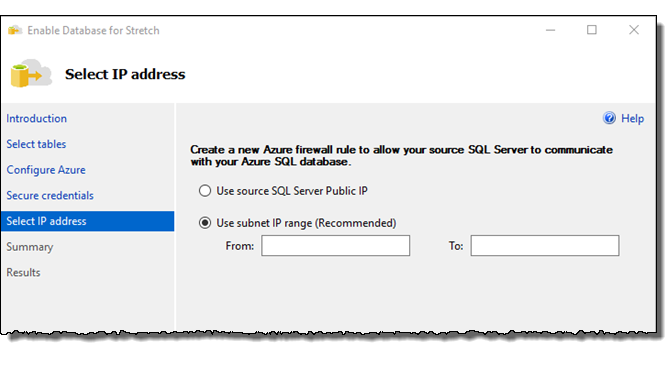  
  
##   Riepilogo  
 Esaminare i valori immessi e le opzioni selezionate nella procedura guidata e i costi previsti in Azure. Selezionare quindi **Fine** per abilitare l'estensione.  
  
 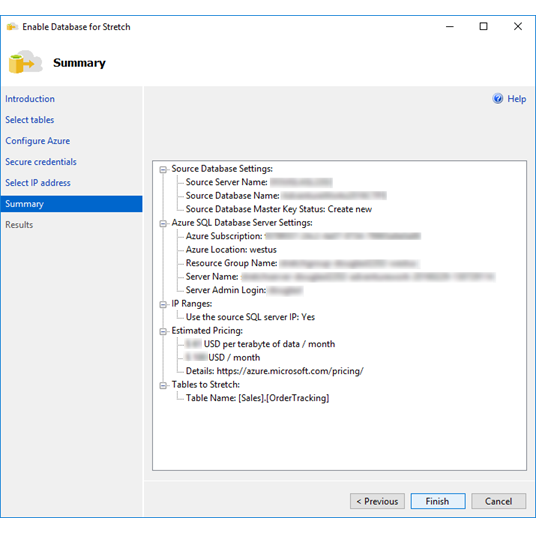  
  
##   Risultati  
 Controllare i risultati.  
  
 Per monitorare lo stato della migrazione dei dati, vedere [Monitor and troubleshoot data migration &#40;Stretch Database&#41; (Monitorare e risolvere i problemi relativi alla migrazione dei dati (Estensione database))](../../sql-server/stretch-database/monitor-and-troubleshoot-data-migration-stretch-database.md).  
  
 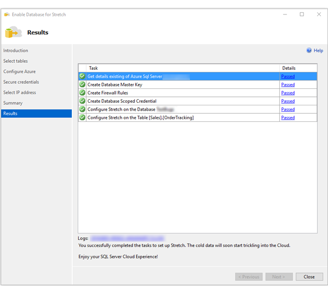  
  
##   Risoluzione dei problemi relativi alla procedura guidata  
 **La procedura guidata Abilitare il database per l'estensione non ha esito positivo.**  
 Se Estensione database non è ancora abilitata a livello di server e se si esegue la procedura guidata senza le autorizzazioni di amministratore di sistema per abilitarlo, la procedura guidata avrà esito negativo. Chiedere all'amministratore di sistema di abilitare Estensione database nell'istanza del server locale e quindi eseguire nuovamente la procedura guidata. Per ulteriori informazioni, vedere [Prerequisite: Permission to enable Stretch Database on the server](../../sql-server/stretch-database/enable-stretch-database-for-a-database.md#EnableTSQLServer).  
  
## Passaggi successivi  
 Abilitare tabelle aggiuntive per Estensione database. Monitorare la migrazione dei dati e gestire tabelle e database abilitati per l'estensione.  
  
-   [Enable Stretch Database for a table](../../sql-server/stretch-database/enable-stretch-database-for-a-table.md) per abilitare altre tabelle.  
  
-   [Monitor and troubleshoot data migration &#40;Stretch Database&#41; (Monitorare e risolvere i problemi relativi alla migrazione dei dati (Estensione database))](../../sql-server/stretch-database/monitor-and-troubleshoot-data-migration-stretch-database.md) per visualizzare lo stato della migrazione dei dati.  
  
-   [Pause and resume data migration &#40;Stretch Database&#41; (Sospendere e riprendere la migrazione dei dati (Estensione database))](../../sql-server/stretch-database/pause-and-resume-data-migration-stretch-database.md)  
  
-   [Gestione e risoluzione dei problemi di Estensione database](../../sql-server/stretch-database/manage-and-troubleshoot-stretch-database.md)  
  
-   [Backup e ripristino di database abilitati per l'estensione](../../sql-server/stretch-database/backup-stretch-enabled-databases-stretch-database.md)  
  
-   [Restore Stretch-enabled databases (Ripristinare database abilitati per l'estensione)](../../sql-server/stretch-database/restore-stretch-enabled-databases-stretch-database.md)  
  
## Vedere anche  
 [Abilitare Estensione database per un database](../../sql-server/stretch-database/enable-stretch-database-for-a-database.md)   
 [Enable Stretch Database for a table (Abilitare Estensione database per una tabella)](../../sql-server/stretch-database/enable-stretch-database-for-a-table.md)  
  
  

