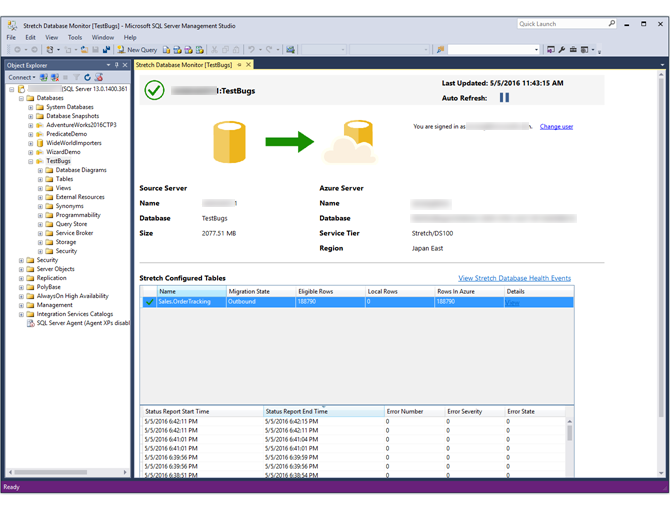

# Monitorare e risolvere i problemi relativi alla migrazione dei dati (Estensione database)
[!INCLUDE[tsql-appliesto-ss2016-xxxx-xxxx-xxx_md](../../includes/tsql-appliesto-ss2016-xxxx-xxxx-xxx-md.md)]

  Per monitorare la migrazione dei dati in Monitoraggio dell'estensione database, selezionare **Attività | Estensione | Monitoraggio** per un database in SQL Server Management Studio.  
  
## Controllare lo stato della migrazione dei dati in Stretch Database Monitor  
 Selezionare **Attività | Estensione | Monitoraggio** per un database in SQL Server Management Studio per aprire Monitoraggio dell'estensione database e monitorare la migrazione dei dati.  
  
-   Nella parte superiore della finestra di monitoraggio vengono visualizzate informazioni generali sul database SQL Server abilitato per l'estensione e sul database Azure remoto.  
  
-   Nella parte inferiore viene visualizzato lo stato della migrazione dei dati per ogni tabella abilitata per l'estensione nel database.  
  
   
  
##   Controllare lo stato della migrazione dei dati in una DMV  
 Aprire la DMV **sys.dm_db_rda_migration_status** per visualizzare il numero di batch e righe di dati di cui è stata eseguita la migrazione. Per altre informazioni, vedere [sys.dm_db_rda_migration_status &#40;Transact-SQL&#41;](../Topic/sys.dm_db_rda_migration_status%20\(Transact-SQL\).md).  
  
##   Risolvere i problemi relativi alla migrazione dei dati  
 **Le righe dalla tabella abilitata per l'estensione non sono incluse nella migrazione ad Azure. Qual è il problema?**  
 Esistono diversi problemi che possono influire sulla migrazione. Verificare quanto segue.  
  
-   Verificare la connettività di rete per il computer SQL Server.  
  
-   Verificare che il firewall di Azure non impedisca a SQL Server di connettersi all'endpoint remoto.  
  
-   Verificare lo stato dell'ultimo batch nella DMV **sys.dm_db_rda_migration_status**. Se si è verificato un errore, controllare i valori error_number, error_state, ed error_severity per il batch.  
  
    -   Per altre informazioni sulla vista, vedere [sys.dm_db_rda_migration_status &#40;Transact-SQL&#41;](../Topic/sys.dm_db_rda_migration_status%20\(Transact-SQL\).md).  
  
    -   Per altre informazioni sul contenuto di un messaggio di errore di SQL Server, vedere [sys.messages &#40;Transact-SQL&#41;](../Topic/sys.messages%20\(Transact-SQL\).md).  
  
 **Il firewall di Azure blocca le connessioni dal server locale.**  
 Può essere necessario aggiungere una regola nelle impostazioni del firewall di Azure del server di Azure per consentire a SQL Server di comunicare con il server remoto di Azure.  
  
## Vedere anche  
 [Gestione e risoluzione dei problemi di Estensione database](../../sql-server/stretch-database/manage-and-troubleshoot-stretch-database.md)  
  
  